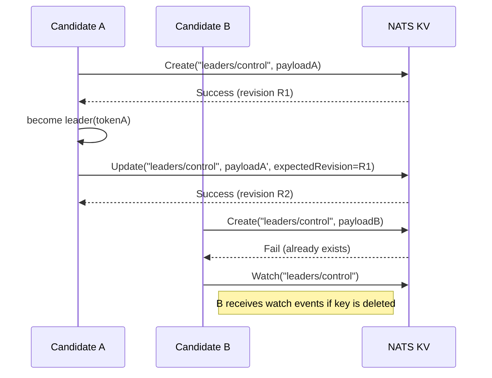
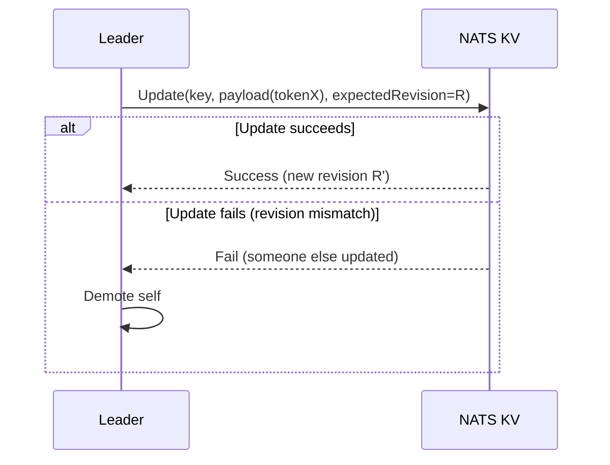
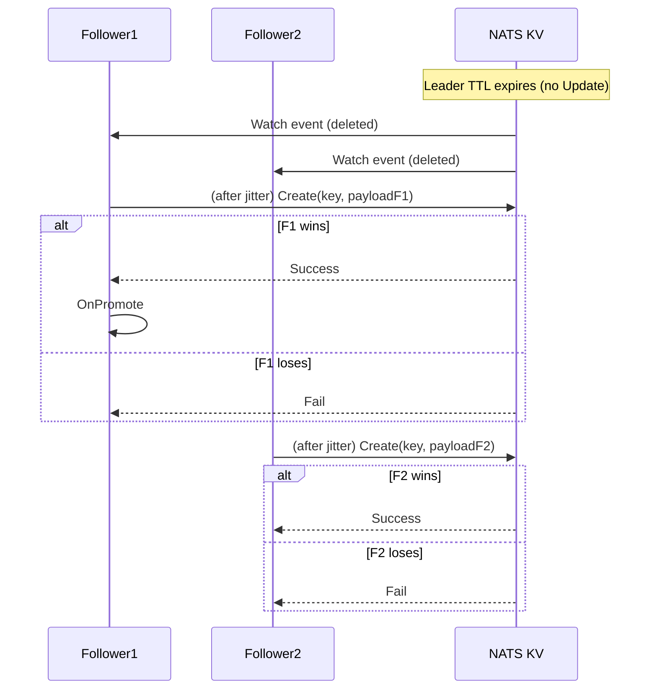
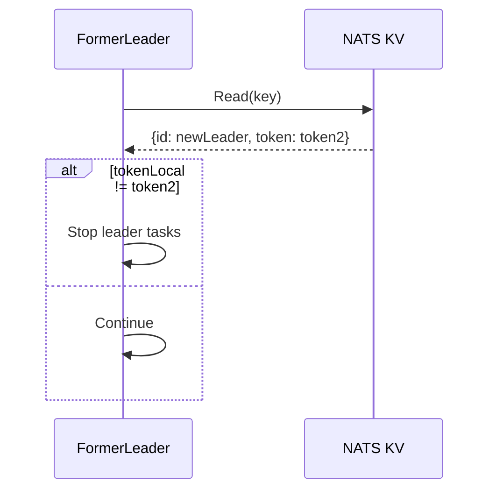
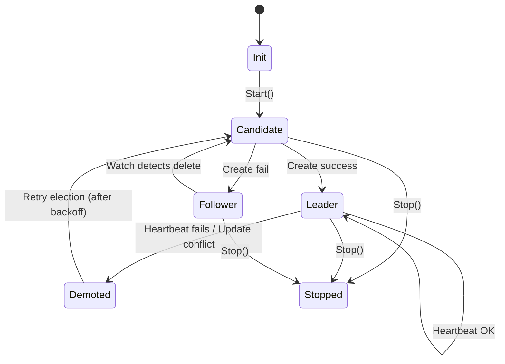
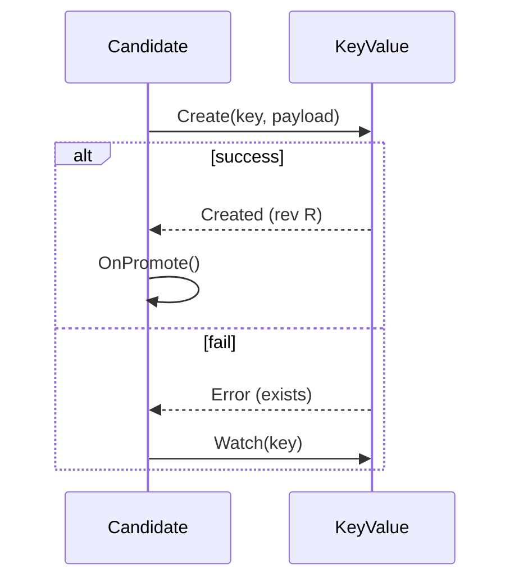
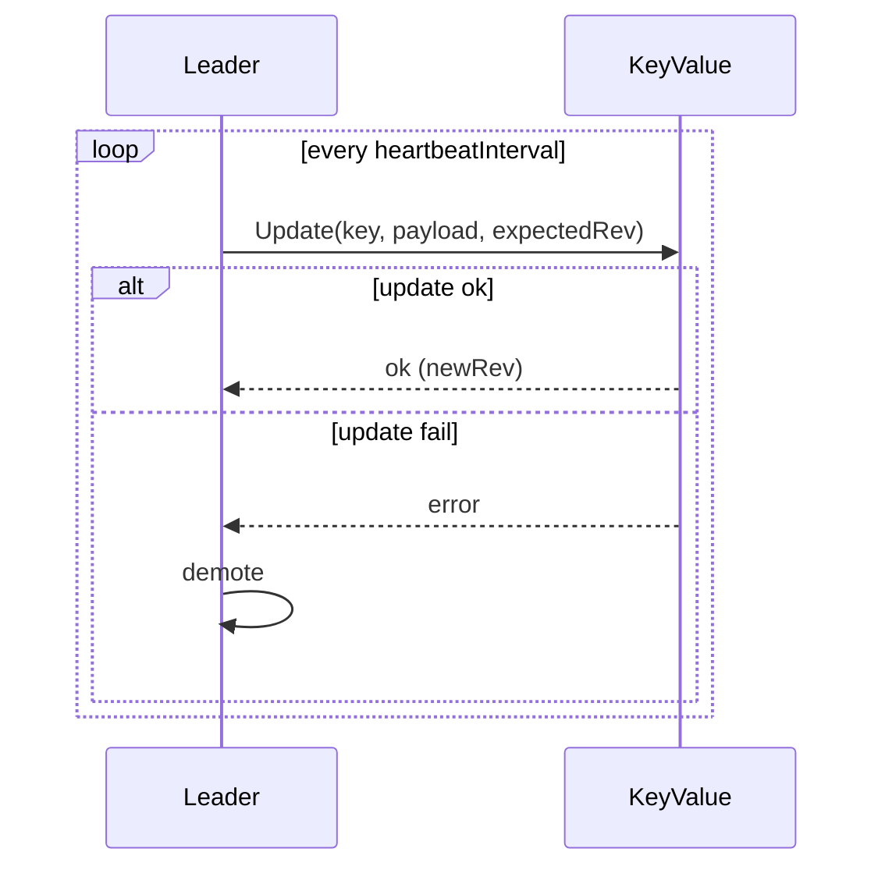
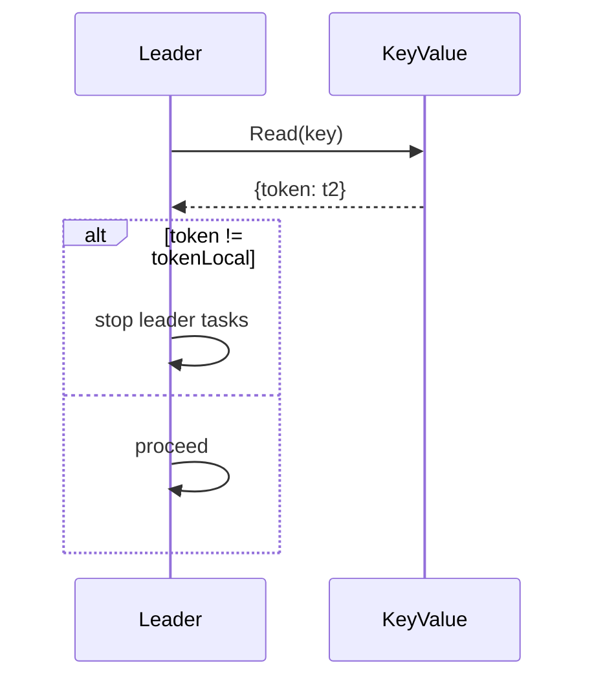

# Design — NATS Leader Election

This document contains sequence diagrams, state diagrams, and detailed walk-throughs for the `nats-leader-election` library. It's intended to complement the README by showing exact control flows, failure modes, and timing considerations.

> Diagrams are written in Mermaid syntax so you can paste them into a renderer (GitHub supports mermaid in markdown). If you prefer PNG/SVG exports, I can generate them separately.

---

## Table of contents

1. Goals & assumptions
2. Core data structures and KV payload
3. Normal election sequence (happy path)
4. Heartbeat and renewal sequence
5. Follower watch and takeover sequence
6. Demotion and fencing sequence
7. State machine
8. Failure scenarios (network partition, slow heartbeat)
9. Thundering herd mitigation & backoff
10. Operational concerns and testing matrix
11. Appendix: sequence diagrams (Mermaid)

---

## 1. Goals & assumptions

**Goals**

* Provide a portable leader election for applications using NATS JetStream KV.
* Minimize the chance of split-brain using KV revision checks and fencing tokens.
* Provide fast failover while guarding against unsafe preemption.
* Support multi-role elections and clear hooks for application logic.

**Assumptions**

* NATS JetStream KV is configured and available (KV is backed by RAFT, cluster available).
* Clients can read, create, update, delete KV keys and subscribe to KV watch events.
* Clock skew exists between hosts — algorithms should *not* rely on synchronized clocks.

---

## 2. Core data structures & KV payload

Recommended JSON payload stored in KV for each election key:

```json
{
  "id": "instance-1234",
  "token": "uuid-v4",
  "priority": 10,
  "meta": {
    "hostname": "node-01",
    "region": "eu-west-1"
  }
}
```

Fields:

* `id` — instance identifier (unique per running process)
* `token` — fencing token (unique per successful acquisition)
* `priority` — integer used for optional priority takeover
* `meta` — arbitrary metadata for debugging/observability

KV entry uses TTL (MaxAge) controlled via `ttl` configuration. Leader must refresh before TTL expires.

---

## 3. Normal election sequence (happy path)

**Description**: multiple candidates A, B, C try to acquire `leaders/control-manager`. A wins, heartbeats, then B and C remain followers.

Mermaid sequence diagram (happy path):



Walk-through notes:

* `Create` is atomic — only one winner.
* Leader stores `revision` returned to use with `Update`.
* Followers use `Watch` to get notified of deletion/changes.

---

## 4. Heartbeat & renewal sequence

**Goal**: Keep leadership alive by refreshing TTL before expiry.

Key points:

* TTL should be several times heartbeat interval: `TTL = heartbeatInterval * 5` (configurable)
* Refresh must be conditional using expected revision to detect competing writes

Mermaid diagram:



Implementation note: If the JS client doesn't provide a strict `Update` with expected revision, use KV's conditional APIs or store and check revision manually.

---

## 5. Follower watch & takeover sequence

**Goal**: When leader disappears (delete or TTL expire), followers compete fairly to acquire leadership.

Sequence:

* Followers receive watch event indicating key deleted or absent
* Each follower waits a small random jitter, then attempts `Create`
* One wins and becomes leader; others become followers again

Mermaid:



Backoff & jitter:

* Randomized jitter before attempting to create (e.g., uniform 10–200ms) reduces thundering herd
* If create fails, exponential backoff with jitter before retrying

---

## 6. Demotion & fencing sequence

**Goal**: Ensure a demoted (or stale) leader cannot continue to perform leader-only actions.

Mechanism:

* Token in KV is authoritative. Leader keeps local copy `tokenLocal`.
* Before performing important operations, leader reads KV and checks token equality.
* If mismatch, abort operation and proceed to demote

Mermaid:



Optimization: keep a cached token and only re-check on critical ops or every N seconds to limit read load.

---

## 7. State machine

States: `INIT` → `CANDIDATE` → `LEADER` or `FOLLOWER` → `DEMOTED` → `STOPPED`

Mermaid state diagram:



Transitions details:

* `Start()` constructs the KV client, creates the watcher, and attempts initial `Create`.
* `Stop()` cancels contexts, stops heartbeat, optionally deletes KV key (if leader & graceful).
* `Demoted` indicates the instance detected loss of leadership due to conflict, network issues, or manual admin action.

---

## 8. Failure scenarios & recommended responses

### Network partition (client isolated from NATS)

* Client cannot heartbeat → TTL expires → other nodes elect new leader
* Isolated client must detect loss of connectivity and demote itself (stop leader tasks) rather than continuing to act
* Implementation: monitor `nats.Conn` status events; if disconnected long enough, demote immediately

### Split brain risk due to staggered KV semantics

* Minimize by using conditional update with expected revision and fencing tokens
* Avoid blind `Put` writes which can overwrite other leader entries

### Slow heartbeats / GC pressure

* Ensure heartbeat frequency is fast enough relative to TTL. Eg: TTL 5s, heartbeat 1s.
* If leader misses X consecutive heartbeats, demote proactively even before TTL expires

### Thundering herd on expiry

* Use small randomized jitter + exponential backoff for retries
* Optionally implement winner selection policy (priority) but prefer voluntary demotion to forced preemption

---

## 9. Thundering herd mitigation & backoff strategy

Suggested strategy:

* On watch event (delete): wait `base + rand(0, jitter)` ms where `base=50ms` and `jitter` up to `200ms`
* On `Create` fail: retry with exponential backoff `min(maxBackoff, base*2^attempt) + rand()`
* Limit concurrent `Create` attempts to avoid saturating KV under heavy churn

---

## 10. Operational concerns & testing matrix

Operational checks:

* Ensure NATS JetStream is configured with enough RAFT quorum for your fault tolerance needs
* Monitor leader transitions per minute — spikes may indicate instability
* Use TLS and NATS accounts to secure KV access

Testing matrix (suggested):

| Test                   | What to simulate              | Expected behavior                                      |
| ---------------------- | ----------------------------- | ------------------------------------------------------ |
| Single leader takeover | Start 3 candidates            | One becomes leader; others follow                      |
| Leader crash           | Kill leader process           | A follower becomes leader quickly                      |
| Network partition      | Block network for leader      | Leader demotes; followers elect new leader             |
| Slow update            | Delay KV update response      | Leader detects failure and demotes if update conflicts |
| Thundering herd        | Expire key with 100 followers | System remains stable; one wins quickly                |

---

## 11. Appendix — Example mermaid diagrams

### 11.1 Initial attempt and promotion



### 11.2 Heartbeat with conflict detection



### 11.3 Demotion and read-before-act fencing



---
