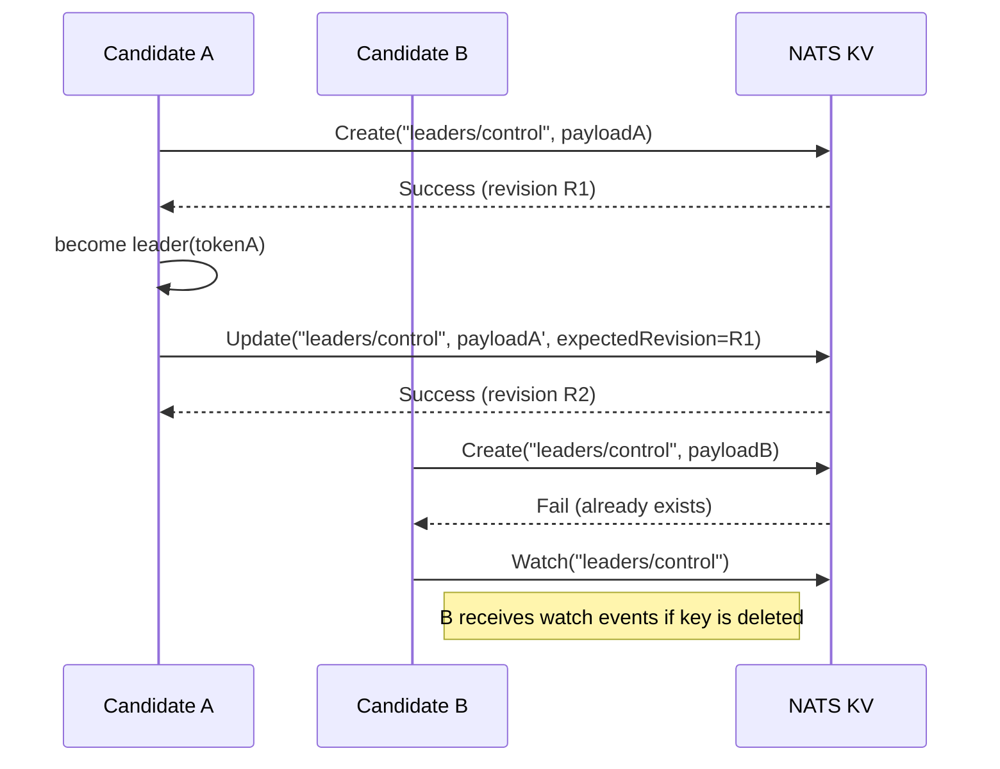
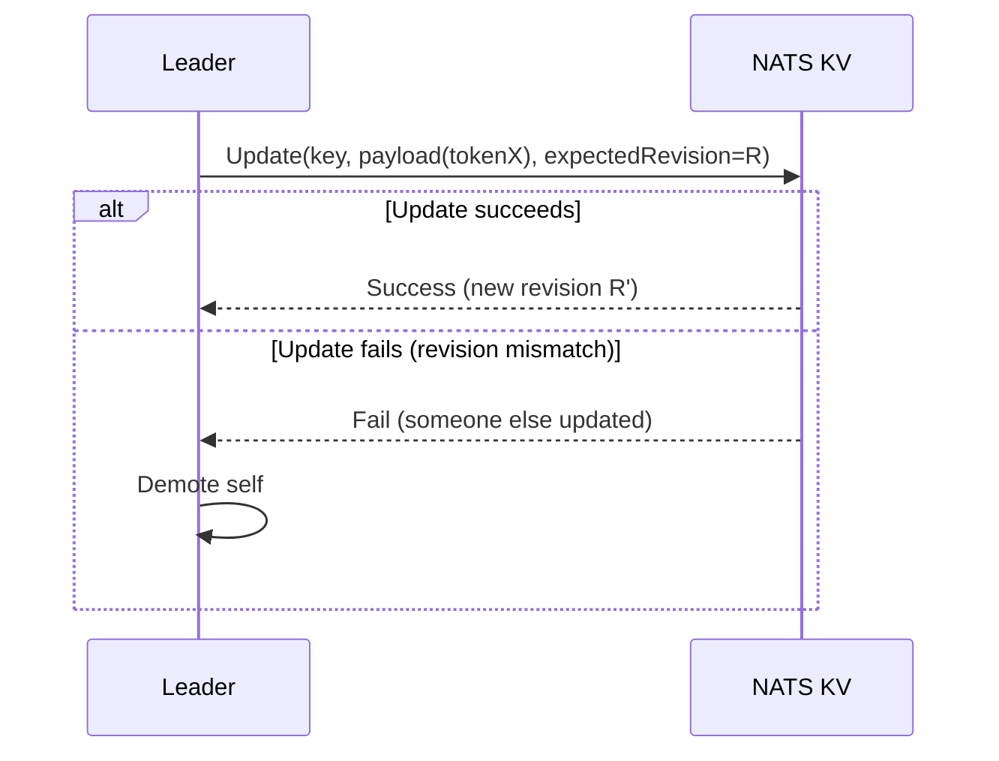
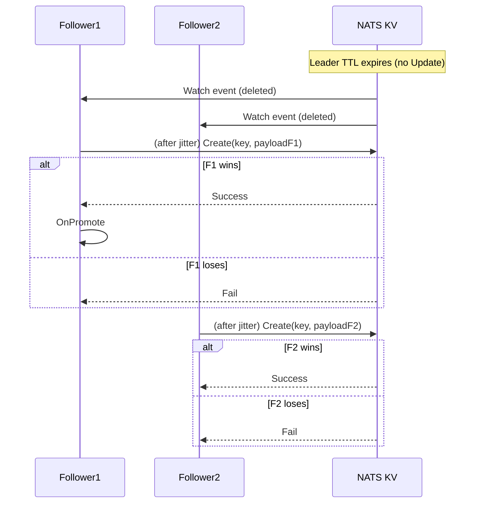
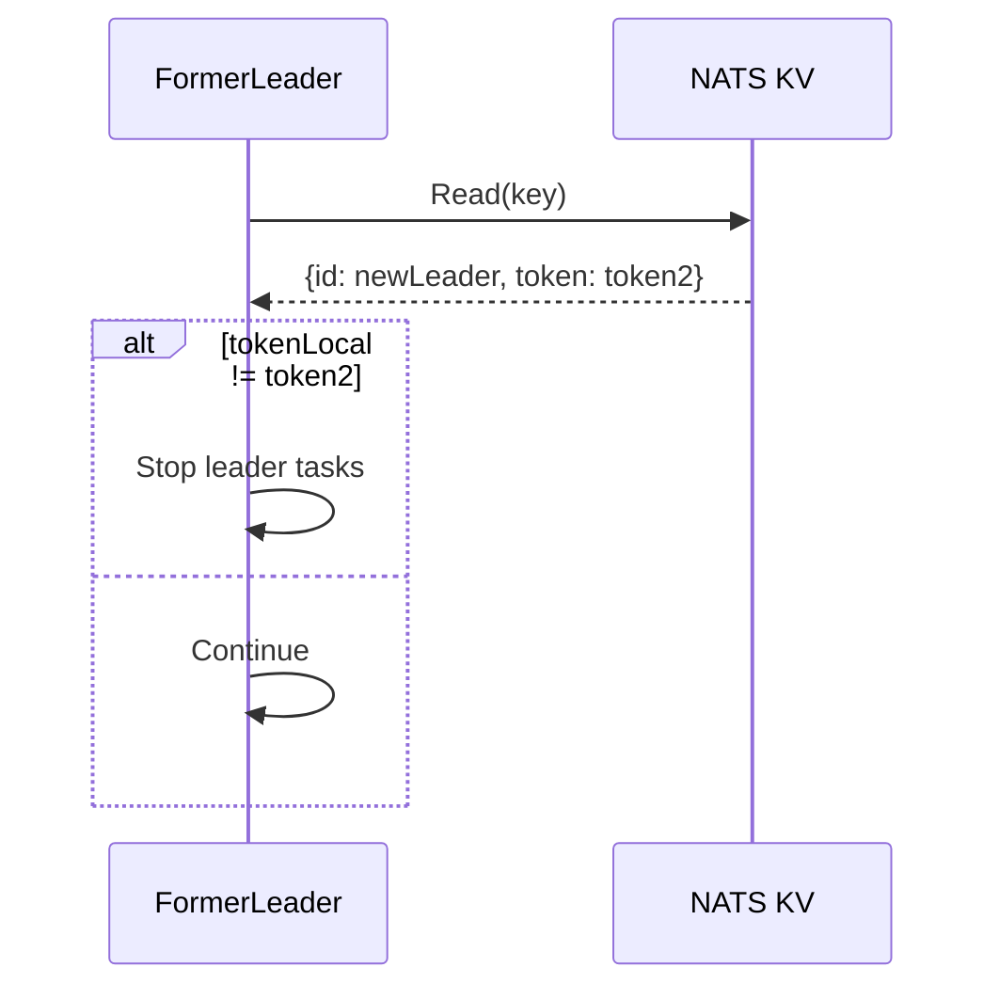
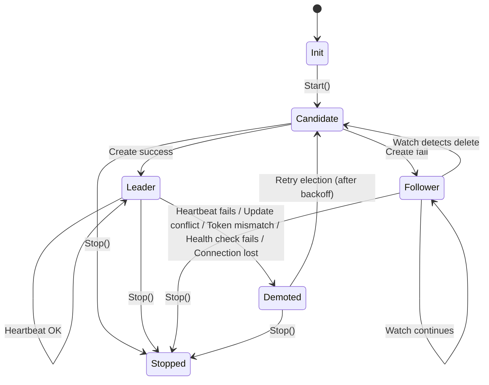
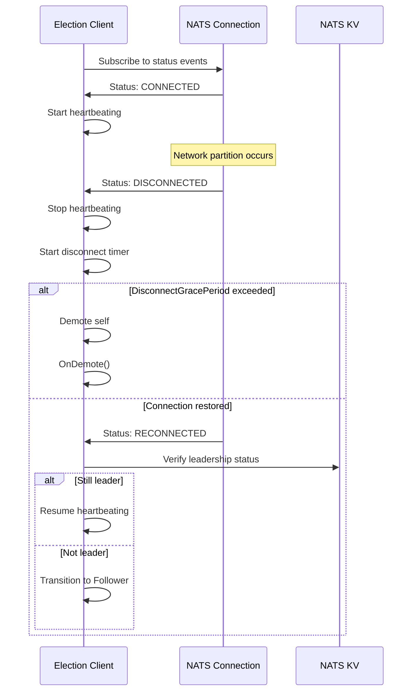
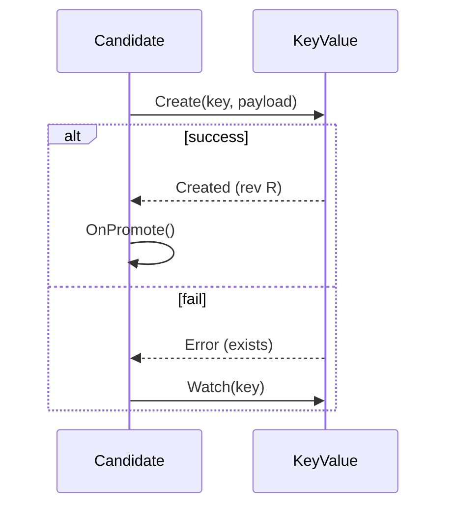
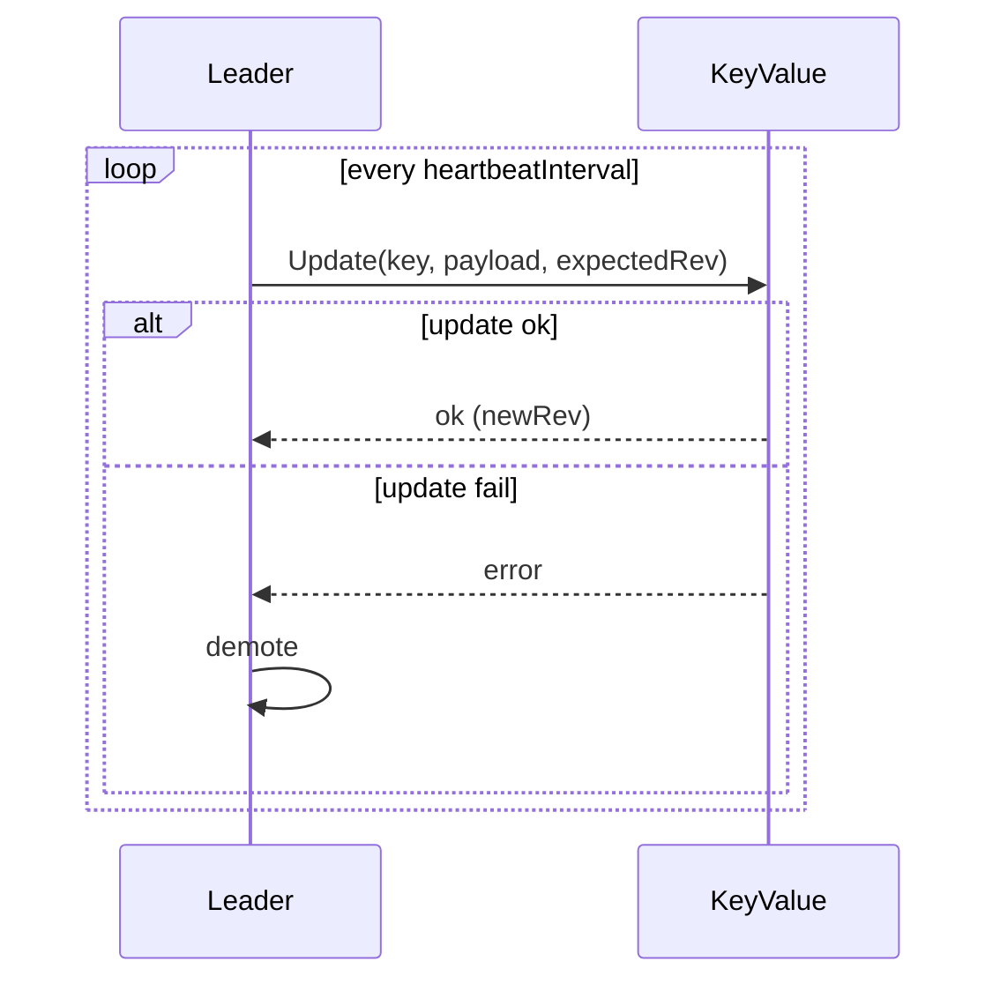
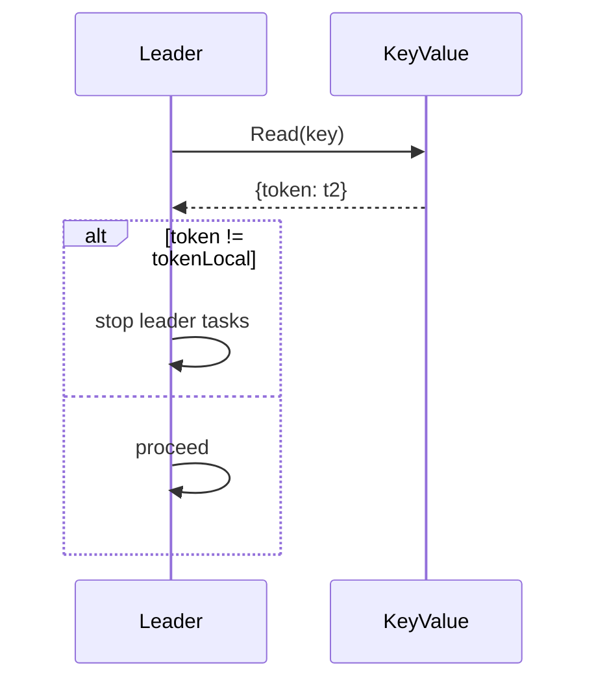

# Design — NATS Leader Election

This document contains sequence diagrams, state diagrams, and detailed walk-throughs for the `nats-leader-election` library. It's intended to complement the README by showing exact control flows, failure modes, and timing considerations.

> Diagrams are written in Mermaid syntax so you can paste them into a renderer (GitHub supports mermaid in markdown). If you prefer PNG/SVG exports, I can generate them separately.

---

## Table of contents

1. Goals & assumptions
2. Core data structures and KV payload
3. Normal election sequence (happy path)
4. Heartbeat and renewal sequence
5. Follower watch and takeover sequence
6. Demotion and fencing sequence
7. State machine
8. Failure scenarios (network partition, slow heartbeat)
9. Thundering herd mitigation & backoff
10. Operational concerns and testing matrix
11. Appendix: sequence diagrams (Mermaid)

---

## 1. Goals & assumptions

**Goals**

* Provide a portable leader election for applications using NATS JetStream KV.
* Minimize the chance of split-brain using KV revision checks and fencing tokens.
* Provide fast failover while guarding against unsafe preemption.
* Support multi-role elections and clear hooks for application logic.

**Assumptions**

* NATS JetStream KV is configured and available (KV is backed by RAFT, cluster available).
* Clients can read, create, update, delete KV keys and subscribe to KV watch events.
* Clock skew exists between hosts — algorithms should *not* rely on synchronized clocks.

---

## 2. Core data structures & KV payload

Recommended JSON payload stored in KV for each election key:

```json
{
  "id": "instance-1234",
  "token": "uuid-v4",
  "priority": 10,
  "meta": {
    "hostname": "node-01",
    "region": "eu-west-1"
  }
}
```

Fields:

* `id` — instance identifier (unique per running process)
* `token` — fencing token (unique per successful acquisition)
* `priority` — integer used for optional priority takeover
* `meta` — arbitrary metadata for debugging/observability

KV entry uses TTL (MaxAge) controlled via `ttl` configuration. Leader must refresh before TTL expires.

---

## 3. Normal election sequence (happy path)

**Description**: multiple candidates A, B, C try to acquire `leaders/control-manager`. A wins, heartbeats, then B and C remain followers.

Mermaid sequence diagram (happy path):



Walk-through notes:

* `Create` is atomic — only one winner.
* Leader stores `revision` returned to use with `Update`.
* Followers use `Watch` to get notified of deletion/changes.

---

## 4. Heartbeat & renewal sequence

**Goal**: Keep leadership alive by refreshing TTL before expiry.

Key points:

* TTL should be several times heartbeat interval: `TTL = heartbeatInterval * 5` (configurable)
* Refresh must be conditional using expected revision to detect competing writes

Mermaid diagram:



Implementation note: If the JS client doesn't provide a strict `Update` with expected revision, use KV's conditional APIs or store and check revision manually.

---

## 5. Follower watch & takeover sequence

**Goal**: When leader disappears (delete or TTL expire), followers compete fairly to acquire leadership.

Sequence:

* Followers receive watch event indicating key deleted or absent
* Each follower waits a small random jitter, then attempts `Create`
* One wins and becomes leader; others become followers again

Mermaid:



Backoff & jitter:

* Randomized jitter before attempting to create (e.g., uniform 10–200ms) reduces thundering herd
* If create fails, exponential backoff with jitter before retrying

---

## 6. Demotion & fencing sequence

**Goal**: Ensure a demoted (or stale) leader cannot continue to perform leader-only actions.

Mechanism:

* Token in KV is authoritative. Leader keeps local copy `tokenLocal`.
* Before performing important operations, leader reads KV and checks token equality.
* If mismatch, abort operation and proceed to demote

Mermaid:



**Enhanced Fencing Strategy:**

1. **Periodic Background Validation:**
   - If `ValidationInterval > 0`, validate token every N seconds
   - Update cached token on successful validation
   - If validation fails, demote immediately

2. **Operation-Level Validation:**
   - If `ValidateOnCriticalOps = true`, always validate before critical operations
   - Critical operations should call `ValidateToken()` before proceeding
   - Non-critical operations can use cached token

3. **Token Caching:**
   - Cache token locally with timestamp
   - Refresh cache on successful heartbeat or validation
   - Use cached token for non-critical operations to reduce KV read load

4. **Validation Flow:**
   ```
   if ValidateOnCriticalOps or (timeSinceLastValidation > ValidationInterval):
       tokenFromKV = kv.Get(key).token
       if tokenFromKV != cachedToken:
           demote()
           return false
       cachedToken = tokenFromKV
       lastValidation = now()
   return true
   ```

---

## 7. State machine

States: `INIT` → `CANDIDATE` → `LEADER` or `FOLLOWER` → `DEMOTED` → `STOPPED`

Mermaid state diagram:



Transitions details:

* `Start()` constructs the KV client, validates configuration, creates the watcher, and attempts initial `Create`.
* `Stop()` cancels contexts, stops heartbeat, optionally deletes KV key (if leader & graceful), waits for OnDemote callback.
* `Demoted` indicates the instance detected loss of leadership due to:
  - Heartbeat failure (revision mismatch, update conflict)
  - Token validation failure
  - Health check failure (if HealthChecker configured)
  - Connection loss (beyond DisconnectGracePeriod)
  - Manual admin action
* State transitions are logged with structured logging including correlation IDs for tracing.
* Each state transition updates metrics (`election_transitions_total`).

---

## 8. Failure scenarios & recommended responses

### Network partition (client isolated from NATS)

* Client cannot heartbeat → TTL expires → other nodes elect new leader
* Isolated client must detect loss of connectivity and demote itself (stop leader tasks) rather than continuing to act
* Implementation: monitor `nats.Conn` status events; if disconnected beyond `DisconnectGracePeriod`, demote immediately
* Connection status monitoring: Subscribe to NATS connection status callbacks and track last successful operation timestamp

### Split brain risk due to staggered KV semantics

* Minimize by using conditional update with expected revision and fencing tokens
* Avoid blind `Put` writes which can overwrite other leader entries
* Always use `Update` with `ExpectedRevision` for heartbeats
* Validate fencing token before any critical operations

### Slow heartbeats / GC pressure

* Ensure heartbeat frequency is fast enough relative to TTL. Eg: TTL 5s, heartbeat 1s.
* If leader misses X consecutive heartbeats, demote proactively even before TTL expires
* Track heartbeat failures and demote if threshold exceeded
* Consider heartbeat timeout: if Update operation takes too long, treat as failure

### Thundering herd on expiry

* Use small randomized jitter + exponential backoff for retries
* Optionally implement winner selection policy (priority) but prefer voluntary demotion to forced preemption
* Implement circuit breaker: if too many failed attempts, back off longer

### NATS KV bucket deletion

* If bucket is deleted while election is running, all operations will fail
* Detect bucket deletion errors and fail fast (don't retry indefinitely)
* Optionally support `BucketAutoCreate` for development (not recommended for production)

### Error classification

* **Transient errors**: Network timeouts, temporary unavailability, connection issues
  - Retry with exponential backoff
  - Don't demote immediately
* **Permanent errors**: Invalid configuration, permission denied, bucket doesn't exist
  - Fail fast, don't retry
  - Return error to caller

### Connection health monitoring

* Track NATS connection status continuously
* If disconnected, stop heartbeating and demote after grace period
* On reconnection, verify leadership status before resuming leader tasks
* Implement connection health check: periodic ping to verify connectivity

---

## 9. Thundering herd mitigation & backoff strategy

Suggested strategy:

* On watch event (delete): wait `base + rand(0, jitter)` ms where `base=50ms` and `jitter` up to `200ms`
* On `Create` fail: retry with exponential backoff `min(maxBackoff, base*2^attempt) + rand()`
* Limit concurrent `Create` attempts to avoid saturating KV under heavy churn

**Detailed Backoff Algorithm:**

```
InitialBackoff = 50ms
MaxBackoff = 5s
BackoffMultiplier = 2.0
Jitter = 0.1 (10%)

For attempt N:
  backoff = min(MaxBackoff, InitialBackoff * (BackoffMultiplier ^ N))
  jitterAmount = backoff * Jitter * rand(-1, 1)
  actualBackoff = backoff + jitterAmount
  wait(actualBackoff)
```

**Circuit Breaker Pattern:**
* Track consecutive failures
* If failures exceed threshold (e.g., 10), enter "circuit open" state
* In circuit open state, back off significantly (e.g., 30s) before retrying
* On success, reset circuit breaker

**Jitter Strategy:**
* Use uniform random jitter for initial attempts (reduces thundering herd)
* Use exponential backoff with jitter for retries (reduces load on KV)

---

## 10. Operational concerns & testing matrix

Operational checks:

* Ensure NATS JetStream is configured with enough RAFT quorum for your fault tolerance needs
* Monitor leader transitions per minute — spikes may indicate instability
* Use TLS and NATS accounts to secure KV access
* Monitor connection status — frequent disconnections indicate network issues
* Track heartbeat latency — high latency may indicate NATS cluster issues
* Monitor token validation failures — indicates potential split-brain scenarios

**Monitoring Recommendations:**

* **Key Metrics:**
  - Leader transition rate (should be low in stable systems)
  - Heartbeat success rate (should be near 100%)
  - Token validation failures (should be 0)
  - Connection uptime (should be near 100%)
  - Election attempt success rate

* **Alerts:**
  - Alert if no leader for > TTL duration
  - Alert if leader transitions > N per minute
  - Alert if heartbeat failures > threshold
  - Alert if connection status is disconnected

**Configuration Best Practices:**

* **Production:**
  - TTL: 10-30 seconds (balance between failover speed and stability)
  - HeartbeatInterval: TTL / 3 to TTL / 5
  - DisconnectGracePeriod: 2-3x HeartbeatInterval
  - Enable token validation on critical operations
  - Use structured logging with appropriate log levels

* **Development:**
  - Shorter TTL for faster testing (3-5 seconds)
  - Enable BucketAutoCreate for convenience
  - More verbose logging

Testing matrix (suggested):

| Test                   | What to simulate              | Expected behavior                                      |
| ---------------------- | ----------------------------- | ------------------------------------------------------ |
| Single leader takeover | Start 3 candidates            | One becomes leader; others follow                      |
| Leader crash           | Kill leader process           | A follower becomes leader quickly                      |
| Network partition      | Block network for leader      | Leader demotes; followers elect new leader             |
| Slow update            | Delay KV update response      | Leader detects failure and demotes if update conflicts |
| Thundering herd        | Expire key with 100 followers | System remains stable; one wins quickly                |
| Connection loss        | Disconnect NATS connection    | Leader demotes after DisconnectGracePeriod             |
| Bucket deletion        | Delete KV bucket              | All operations fail fast, no infinite retries          |
| Token validation       | Manually change token in KV   | Leader detects mismatch and demotes                    |
| Graceful shutdown      | Call Stop() on leader         | Key deleted (if enabled), OnDemote called, clean exit  |
| Health check failure   | HealthChecker returns false   | Leader voluntarily demotes                             |
| Priority takeover      | Higher priority candidate     | Only if AllowPriorityTakeover enabled and safe         |
| Clock skew             | Simulate clock differences    | System works correctly (doesn't rely on clocks)        |
| GC pressure            | Force GC during heartbeat     | Heartbeat may be delayed but should recover            |
| NATS server restart    | Restart NATS cluster          | Clients reconnect, leadership maintained or re-elected |

## 11. Connection management & lifecycle

**Connection Health Monitoring:**

The library continuously monitors NATS connection status to detect network issues and prevent stale leadership.



**Implementation Details:**

1. **Connection Status Tracking:**
   - Subscribe to NATS connection status callbacks
   - Track last successful operation timestamp
   - On disconnect, start grace period timer

2. **Reconnection Handling:**
   - On reconnect, verify leadership by reading KV
   - Compare token to ensure still valid leader
   - Only resume leader tasks if verification succeeds

3. **Connection Timeout:**
   - All KV operations use `ConnectionTimeout`
   - Operations that exceed timeout are treated as failures
   - Timeout should be less than `HeartbeatInterval` to detect issues quickly

## 12. Error handling & retry strategy

**Error Classification:**

Errors are classified as either transient or permanent:

* **Transient Errors** (retry with backoff):
  - Network timeouts
  - Temporary NATS unavailability
  - Connection issues
  - Rate limiting (if applicable)

* **Permanent Errors** (fail fast):
  - Invalid configuration
  - Permission denied
  - Bucket doesn't exist (unless BucketAutoCreate enabled)
  - Invalid instance ID

**Retry Strategy:**

```go
type RetryConfig struct {
    MaxAttempts      int           // 0 = unlimited
    InitialBackoff   time.Duration
    MaxBackoff       time.Duration
    BackoffMultiplier float64
    Jitter           float64
}

func retryWithBackoff(ctx context.Context, cfg RetryConfig, fn func() error) error {
    attempt := 0
    for {
        err := fn()
        if err == nil {
            return nil
        }
        
        if isPermanentError(err) {
            return err // Don't retry permanent errors
        }
        
        if cfg.MaxAttempts > 0 && attempt >= cfg.MaxAttempts {
            return fmt.Errorf("max attempts exceeded: %w", err)
        }
        
        backoff := calculateBackoff(cfg, attempt)
        select {
        case <-ctx.Done():
            return ctx.Err()
        case <-time.After(backoff):
            attempt++
        }
    }
}
```

## 13. Configuration validation

**Validation Rules:**

1. **TTL vs HeartbeatInterval:**
   - `TTL >= HeartbeatInterval * 3` (minimum safety margin)
   - Recommended: `TTL >= HeartbeatInterval * 5`

2. **InstanceID:**
   - Must be non-empty
   - Should be unique per running process
   - Recommended: include hostname, PID, or UUID

3. **Bucket:**
   - Must be non-empty
   - Should exist (unless BucketAutoCreate enabled)
   - Must be accessible with provided credentials

4. **Timeouts:**
   - `ConnectionTimeout` should be < `HeartbeatInterval`
   - `DisconnectGracePeriod` should be >= `HeartbeatInterval * 2`

5. **Fencing:**
   - If `ValidationInterval > 0`, should be >= `HeartbeatInterval`
   - If `ValidateOnCriticalOps = true`, ensure critical operations call validation

**Validation Implementation:**

```go
func validateConfig(cfg ElectionConfig) error {
    if cfg.TTL < cfg.HeartbeatInterval*3 {
        return fmt.Errorf("TTL must be at least 3x HeartbeatInterval")
    }
    if cfg.InstanceID == "" {
        return fmt.Errorf("InstanceID is required")
    }
    if cfg.Bucket == "" {
        return fmt.Errorf("Bucket is required")
    }
    if cfg.ConnectionTimeout > 0 && cfg.ConnectionTimeout >= cfg.HeartbeatInterval {
        return fmt.Errorf("ConnectionTimeout should be less than HeartbeatInterval")
    }
    // ... more validations
    return nil
}
```

---

## 14. Appendix — Example mermaid diagrams

### 11.1 Initial attempt and promotion



### 11.2 Heartbeat with conflict detection



### 11.3 Demotion and read-before-act fencing



---
